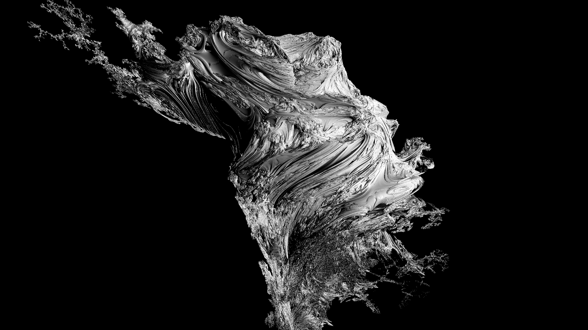

# Raymarch

<!-- Banner Image -->

## Description

This is a basic raymarcher written in Rust. It's unique feature is that it uses various SIMD intrinsics to speed up the raymarching process. It also uses a custom vector library that uses the same intrinsics to speed up vector operations. The raymarcher is also multithreaded and utilizes CAS instructions for efficient shared memory access.

## Current WIP:
- [ ] Basic lighting
- [ ] Basic lighting via GPU (Vulkan)
- [x] Basic raymarching
